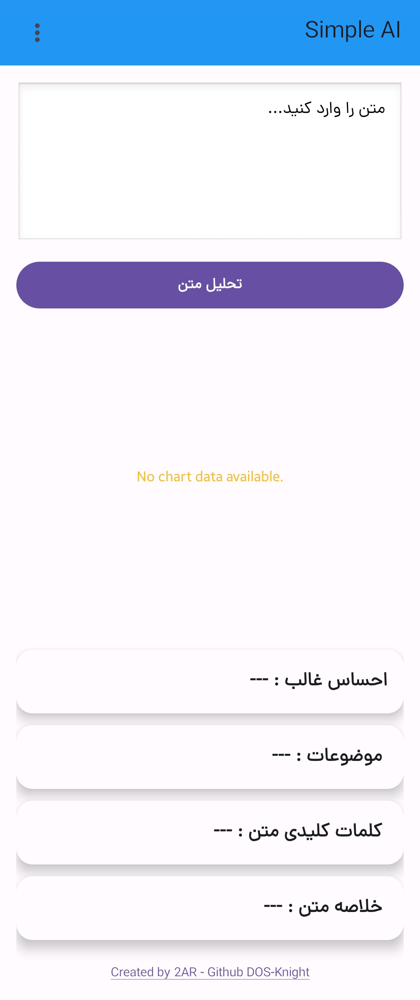
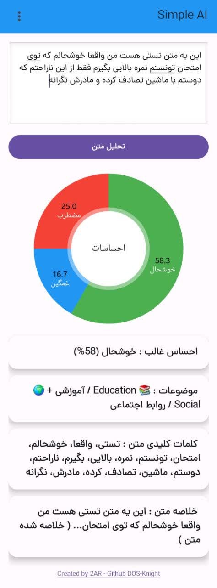
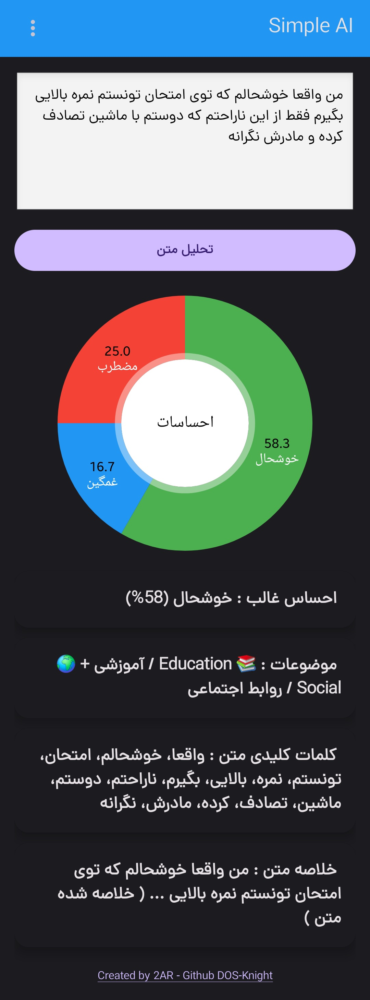
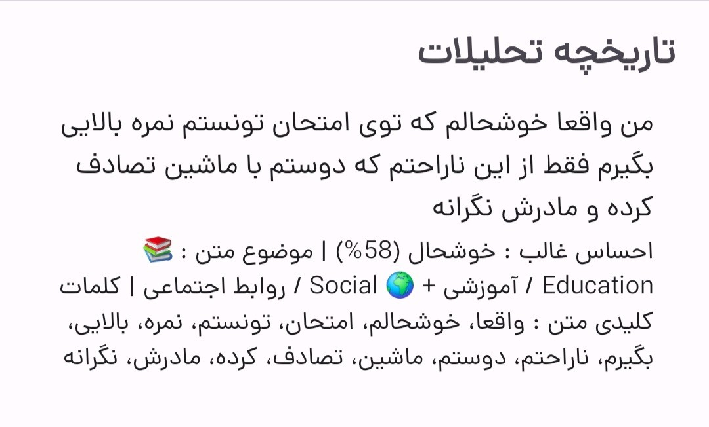

<p align="center">
  
</p>

<h1 align="center">🧠 Simple AI Text Analyzer</h1>

<p align="center">
  An intelligent offline Android application that performs sentiment analysis, topic classification, keyword extraction, and text summarization using lightweight Natural Language Processing techniques.
</p>

<p align="center">
  <strong>100% Offline • Privacy-Focused • No APIs Required</strong>
</p>

---

## 📖 About The Project

Simple AI Text Analyzer is a lightweight Android application that demonstrates practical Natural Language Processing (NLP) concepts directly on mobile devices.

Unlike many AI-powered applications, all text processing is performed locally on the device without relying on cloud services, external APIs, or internet connectivity.

The application analyzes user input and generates valuable insights such as emotional sentiment, topic categorization, keyword extraction, and concise summaries while maintaining complete user privacy.

---

## ✨ Features

### 😊 Sentiment Analysis

Detect emotional tone using weighted keyword scoring.

Supported emotions:

* Happy
* Sad
* Angry
* Anxious
* Neutral

### 📚 Topic Classification

Automatically identify one or more relevant categories:

* Technology
* Education
* Health
* Sports
* Economy
* Entertainment
* Science
* General

### 🔑 Keyword Extraction

Extract meaningful keywords and important concepts from text.

Supported Languages:

* English
* Persian (Farsi)

### ✂️ Text Summarization

Generate concise summaries using extractive summarization techniques.

### 📊 Data Visualization

Visualize emotion distribution using interactive charts powered by MPAndroidChart.

### 💾 Local History

Store previous analyses using SQLite for quick access and review.

### 🌙 Modern Android Experience

* Material Design UI
* Dark Mode Support
* Responsive Layout
* Fast Local Processing
* Fully Offline Operation

---

## 🧠 NLP Pipeline

```text
Input Text
    │
    ▼
Keyword Processing
    │
    ├── Sentiment Analysis
    ├── Topic Classification
    ├── Keyword Extraction
    └── Text Summarization
    │
    ▼
Results & Visualization
```

---

## 🏗 Architecture

```text
MainActivity
│
├── SentimentAnalyzer
├── TopicAnalyzer
├── KeywordExtractor
├── SummaryGenerator
│
├── DatabaseHelper
│
└── HistoryActivity
```

### Core Components

| Component         | Description                     |
| ----------------- | ------------------------------- |
| MainActivity      | Main user interface             |
| SentimentAnalyzer | Emotion detection engine        |
| TopicAnalyzer     | Multi-label topic classifier    |
| KeywordExtractor  | Keyword extraction module       |
| SummaryGenerator  | Extractive summarization engine |
| DatabaseHelper    | SQLite database manager         |
| HistoryActivity   | Analysis history viewer         |

---

## 🛠 Technology Stack

| Technology      | Purpose                 |
| --------------- | ----------------------- |
| Java            | Application Development |
| Android SDK     | Mobile Platform         |
| SQLite          | Local Storage           |
| AndroidX        | Android Components      |
| Material Design | User Interface          |
| MPAndroidChart  | Data Visualization      |

---

## 📱 Screenshots

### Home Screen

<p align="left">
  
</p>

### Analysis Results

<p align="left">
  
</p>

### Dark Theme Screen

<p align="left">
  
</p>

### History Screen

<p align="left">
  
</p>


---

## 🚀 Installation

### Clone Repository

```bash
git clone https://github.com/DOS-Knight/Simple-AI-Text-Analyzer.git
```

### Run Locally

1. Open Android Studio
2. Select **Open Project**
3. Choose the cloned repository
4. Wait for Gradle Sync
5. Run on an Android emulator or physical device

---

## 🔒 Privacy

All text analysis is performed locally on the user's device.

No data is:

* Uploaded
* Shared
* Collected
* Tracked
* Sent to external servers

The application works entirely offline.

---

## 🔮 Future Roadmap

* TensorFlow Lite Integration
* Advanced NLP Processing
* Named Entity Recognition (NER)
* Voice Input Support
* Enhanced Summarization Algorithms
* Multi-Language Expansion
* Export & Share Features

---

## 🤝 Contributing

Contributions, suggestions, and improvements are welcome.

1. Fork the repository
2. Create a feature branch
3. Commit your changes
4. Open a Pull Request

---

## 👨‍💻 Author

**DOS-Knight**

GitHub: https://github.com/DOS-Knight

---

## ⭐ Support

If you find this project useful, consider starring the repository.

---

## 📄 License

Licensed under the MIT License.
See LICENSE for more information.
